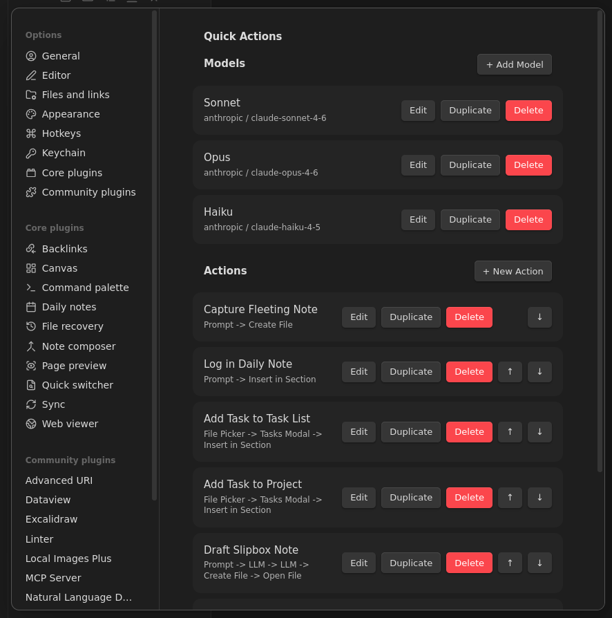
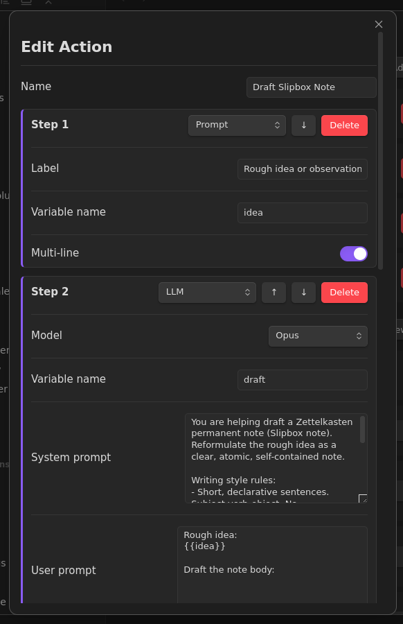
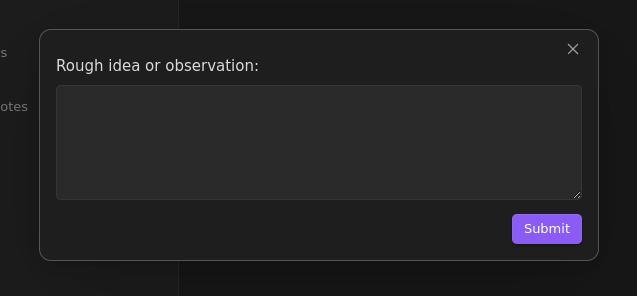

# Quick Actions

Configurable quick actions for common vault operations. Build custom commands from composable steps.



## Features

- **Composable step pipelines** - chain multiple steps into a single command
- **Template variables** - use `{{date}}`, `{{time}}`, `{{timestamp}}`, and step output variables in any field
- **LLM integration** - call Anthropic or OpenAI models as pipeline steps, with output available to downstream steps
- **Multiple named models** - configure several LLM models and choose per-step which to use
- **File creation and editing** - create new files or insert content into specific sections of existing files
- **Interactive inputs** - prompt the user for text, pick files from folders, or present choice menus
- **Auto-registered commands** - every action becomes an Obsidian command, accessible via the command palette or hotkeys
- **Mobile support** - works on both desktop and mobile

## Step Types

| Step | Description |
|------|-------------|
| **Prompt** | Ask the user for text input (single-line or multi-line) |
| **File Picker** | Let the user pick a markdown file from a folder |
| **Tasks Modal** | Open the Tasks plugin modal to create a task line |
| **Insert in Section** | Append or prepend text to a heading section in a file |
| **Create File** | Create a new markdown file with templated content |
| **Choice** | Present a list of options for the user to pick from |
| **Open File** | Open a file in the editor, optionally scrolling to a section |
| **LLM** | Send a prompt to an LLM and store the response in a variable |

## Template Variables

All text fields (file paths, content, prompts) support `{{variable}}` substitution.

**Built-in variables** (available in every step):

| Variable | Value |
|----------|-------|
| `{{date}}` | Current date as `YYYY-MM-DD` |
| `{{time}}` | Current time as `HH:mm` |
| `{{timestamp}}` | Current timestamp as `YYYYMMDDHHmmss` |

**Step variables** - each input step (Prompt, File Picker, Tasks Modal, Choice, LLM) stores its result in a named variable that downstream steps can reference. For example, a Prompt step with variable `idea` makes `{{idea}}` available to all subsequent steps.

## LLM Integration

Quick Actions can call LLM APIs as pipeline steps, letting you build AI-assisted workflows entirely within Obsidian.

### Setting Up Models

1. Go to **Settings > Quick Actions > Models** and click **+ Add Model**
2. Choose a **Provider** (Anthropic or OpenAI)
3. Enter the **Model ID** (e.g., `claude-sonnet-4-6`, `gpt-4o`)
4. Set an **API Key Secret ID** - this references a secret stored in Obsidian's built-in Keychain (Settings > Keychain)

You can configure multiple models (e.g., a fast model for classification, a capable model for drafting) and select which model each LLM step uses.

### Supported Providers

| Provider | API | Auth Header |
|----------|-----|-------------|
| **Anthropic** | Messages API (`/v1/messages`) | `x-api-key` |
| **OpenAI** | Chat Completions API (`/v1/chat/completions`) | `Authorization: Bearer` |

### Using LLM Steps

Each LLM step has:
- **Model** - which configured model to use (defaults to the first model if unset)
- **System prompt** - sets the LLM's behavior and instructions
- **User prompt** - the input to the LLM, typically containing `{{variables}}` from prior steps
- **Variable name** - where to store the LLM's response for downstream steps

LLM steps can be chained: one step drafts content, another generates a title, a third classifies it - all feeding into a final Create File step.

## Examples

### Capture Fleeting Note

A two-step action: prompt for a thought, then create a timestamped file in the Inbox.

| Step | Type | Details |
|------|------|---------|
| 1 | Prompt | Label: "Fleeting thought:", multi-line, variable: `thought` |
| 2 | Create File | Path: `Inbox/F-{{timestamp}}`, content includes `{{thought}}` |

### Log in Daily Note

Append a timestamped entry to today's daily note, creating it from a template if it doesn't exist.

| Step | Type | Details |
|------|------|---------|
| 1 | Prompt | Label: "Entry:", variable: `entry` |
| 2 | Insert in Section | Target: `Journal/Daily/D-{{date}}`, section: `## Log`, format: `({{time}}) {{entry}}`, create if missing from template |

### Draft Slipbox Note (LLM-powered)

A five-step action that takes a rough idea, uses an LLM to draft a polished note body and generate a title, creates the file, and opens it.

| Step | Type | Details |
|------|------|---------|
| 1 | Prompt | "Rough idea or observation:", multi-line, variable: `idea` |
| 2 | LLM (Opus) | Drafts the note body from `{{idea}}`, variable: `draft` |
| 3 | LLM (Haiku) | Generates a short title from `{{draft}}` and `{{idea}}`, variable: `title` |
| 4 | Create File | Path: `Slipbox/{{timestamp}} - {{title}}`, content uses `{{title}}`, `{{draft}}`, `{{idea}}` |
| 5 | Open File | Opens the newly created note |





## Installation

### Manual

```bash
git clone https://github.com/matiasvc/obsidian-quick-actions.git
cd obsidian-quick-actions
npm install
npm run build
```

Then copy `main.js`, `manifest.json`, and `styles.css` to your vault's `.obsidian/plugins/obsidian-quick-actions/` directory and enable the plugin in Settings > Community plugins.

### Community Plugin

Search for "Quick Actions" in Settings > Community plugins > Browse (when available).

## License

MIT
